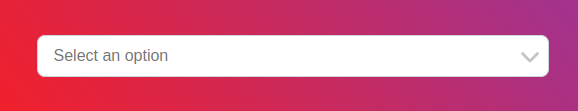
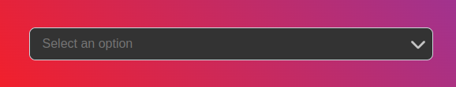
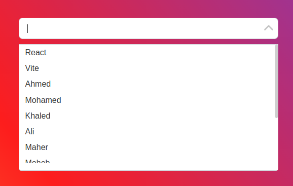
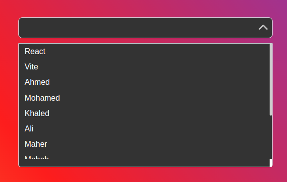
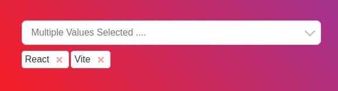
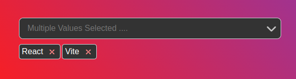

# Turbo Select 🚀

Turbo Select is a flexible and feature-rich React component that provides a convenient dropdown select menu for your applications. Whether you need a simple single selection or a more complex multiple selection with tags, Turbo Select has got you covered. It offers various customization options, making it suitable for a wide range of use cases.

## Preview

|    LIGHT MODE     |     DARK MODE     |
| :---------------: | :---------------: |
|  |  |
|  |  |
|  |  |

---

## ⚙️ Installation

To install Turbo Select in your React project, you can use npm or yarn:

```bash
npm install react-turbo-select
```

or

Copy

```bash
yarn add react-turbo-select
```

## ⚙️ Props

Turbo Select accepts the following props:

| ⚙️ Props                  | 💡 Description                                                             |
| ------------------------- | -------------------------------------------------------------------------- |
| `isSearchable`            | Enable searching/filtering options.                                        |
| `isLoading`               | Show loading indicator when options are being loaded asynchronously.       |
| `isClearable`             | Allow clearing the selected option(s).                                     |
| `isMultiple`              | Allow multiple option selection.                                           |
| `showTagsControls`        | Show tags for selected options when in multiple selection mode.            |
| `isDisabled`              | Disable the select component.                                              |
| `closeOnSelect`           | Close the dropdown menu after selecting an option.                         |
| `menuOpen`                | Initial state of the dropdown menu (open or closed).                       |
| `noOptionsMessage`        | Custom message to display when no options are available.                   |
| `loadingMessage`          | Custom message to display when options are loading.                        |
| `autoFocus`               | Automatically focus on the input when the component mounts.                |
| `onMenuOpen`              | Callback function when the dropdown menu opens.                            |
| `onMenuClose`             | Callback function when the dropdown menu closes.                           |
| `onReachMaxScroll`        | Callback function when the menu reaches its maximum scroll position.       |
| `openMenuOnClick`         | Open the menu when clicking on the component.                              |
| `escapeCloseMenu`         | Allow closing the menu when pressing the escape key.                       |
| `isRtl`                   | Set the component to support right-to-left languages.                      |
| `dropDownIcon`            | Custom icon to display as the dropdown indicator.                          |
| `defaultMenuIsScrollable` | Enable scrolling in the dropdown menu by default.                          |
| `options`                 | An array of `Option` objects (interface defined in the package).           |
| `getContainerRef`         | Callback function to get the reference of the container element.           |
| `getInputRef`             | Callback function to get the reference of the input element.               |
| `getMenuRef`              | Callback function to get the reference of the dropdown menu element.       |
| `containerStyles`         | Custom styles for the main container element.                              |
| `inputStyles`             | Custom styles for the input element.                                       |
| `menuStyles`              | Custom styles for the dropdown menu.                                       |
| `optionStyles`            | Custom styles for the options in the dropdown menu.                        |
| `defaultValue`            | The default selected option(s).                                            |
| `onChange`                | Callback function when the selected option(s) change.                      |
| `placeholder`             | Placeholder text for the input.                                            |
| `width`                   | Width of the select component (default: 300).                              |
| `height`                  | Height of the select component (default: 40).                              |
| `menuHeight`              | Maximum height of the dropdown menu (default: 250).                        |
| `iconFlicker`             | Enable icon flickering animation (default: false).                         |
| `borderRadius`            | Border radius for the select component (default: "tiny").                  |
| `gapBetweenControls`      | Gap between the controls (tag and dropdown icon) (default: 10).            |
| `tagStyle`                | Custom styles for the tags in multiple selection mode.                     |
| `mode`                    | Color mode of the select component ("light" or "dark") (default: "light"). |

## 🎉 Getting Started

To get started with Turbo Select, simply import the component into your project:

Copy

```jsx
import TurboSelect from "react-turbo-select";
// import the style sheet of the library
import "react-turbo-select/dist/style.css";
```

## 📖 Usage

Here's a quick example of how you can use Turbo Select in your React application:

Copy

```jsx
import React from "react";
import TurboSelect from "react-turbo-select";
// import the style sheet of the library
import "react-turbo-select/dist/style.css";

const options = [
  { value: "1", label: "Option 1" },
  { value: "2", label: "Option 2" },
  { value: "3", label: "Option 3" },
  // Add more options as needed
];

const MyComponent = () => {
  // Your component logic here
  return (
    <div>
      <h1>My Awesome App</h1>
      <TurboSelect options={options} />
      {/* Add more components and logic */}
    </div>
  );
};

export default MyComponent;
```
